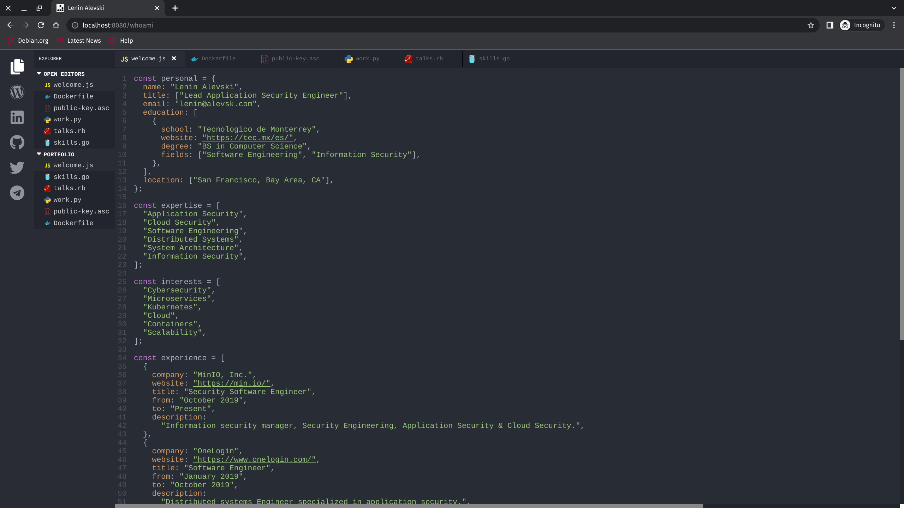

# This is how it looks!

Yes it is! In 2019 I built this website. I focused on capture the coder feeling, my friends told me it's an undisputed masterpiece and people loved it in general, in fact the website is so cool most people probably won't take some time to read the actual content. But they should, because it's not just a cool website inspired on vscode using dark mode, it's also a personal statement about me and what I do.

## Development

In the project directory, you can run:

### `yarn start`

Runs the app in the development mode.

Open [http://localhost:3000](http://localhost:3000) to view it in the browser. The page will reload if you make edits. You will also see any lint errors in the console.

### `yarn build`

Builds the app for production to the `build` folder. It correctly bundles React in production mode and optimizes the build for the best performance. The build is minified and the filenames include the hashes.

## Build docker image

Your app is ready to be deployed!

### `TAG=$NAME make docker`

Builds a new docker image using the provided `tag` name

## Run docker container using docker-compose

### `docker-compose up`

Runs the project as a docker container

Open [http://localhost:8080](http://localhost:8080) to view it in the browser.
